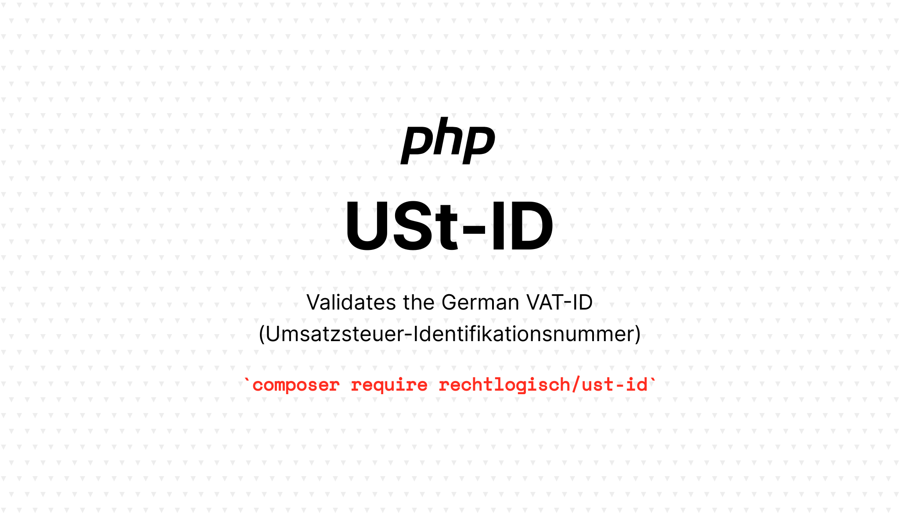

[](https://packagist.org/packages/rechtlogisch/ust-id)
[](https://github.com/rechtlogisch/ust-id/actions/workflows/run-tests.yml)
[](https://packagist.org/packages/rechtlogisch/ust-id)

# ust-id

> Validates the German VAT-ID (Umsatzsteuer-Identifikationsnummer, short: USt-ID)

Check digit (last digit) is validated based on [ISO/IEC 7064, MOD 11,10](https://www.iso.org/standard/31531.html) as documented within the meanwhile repealed "Datenträger-Verordnung über die Abgabe Zusammenfassender Meldungen – ZMDV" dated 13.05.1993 ([BGBl. I S. 736](https://www.bgbl.de/xaver/bgbl/start.xav?start=%2F%2F*%5B%40attr_id%3D%27bgbl193s0726.pdf%27%5D#__bgbl__%2F%2F*%5B%40attr_id%3D%27bgbl193s0726.pdf%27%5D__1720528216746)).

> [!NOTE]
> This package validates solely the syntax and check digit of the provided input. It does not confirm, that the provided USt-ID was assigned to an entrepreneur. Please use the official [VIES](https://ec.europa.eu/taxation_customs/vies/) service for that.

## Installation

You can install the package via composer:

```bash
composer require rechtlogisch/ust-id
```

## Usage

```php
isUstIdValid('DE123456789'); // => true
```

or

```php
use Rechtlogisch\UstId\UstId;

(new UstId('DE123456789'))
    ->validate() // ValidationResult::class
    ->isValid(); // => true
```

## Validation errors

You can get a list of errors explaining why the provided input is invalid. The `validate()` method returns a DTO with a `getErrors()` method.

> [!NOTE]
> The keys of `getErrors()` hold the stringified reference to the exception class. You can check for a particular error by comparing to the ::class constant. For example: `Rechtlogisch\UstId\Exceptions\InvalidUstIdLength::class`.

```php
validateUstId('DE12345678')->getErrors();
// [
//   'Rechtlogisch\UstId\Exceptions\InvalidUstIdLength'
//    => 'USt-ID must be 11 characters long. Provided USt-ID is: 10 characters long.',
// ]
```
or

```php
use Rechtlogisch\UstId\UstId;

(new UstId('DE12345678'))
    ->validate()
    ->getErrors();
// [
//   'Rechtlogisch\UstId\Exceptions\InvalidUstIdLength'
//    => 'USt-ID must be 11 characters long. Provided USt-ID is: 10 characters long.',
// ]
```

## Testing

```bash
composer test
```

## Changelog

Please see [CHANGELOG](CHANGELOG.md) for more information on what has changed recently.

## Contributing

Please see [CONTRIBUTING](https://github.com/rechtlogisch/.github/blob/main/CONTRIBUTING.md) for details.

## Security Vulnerabilities

If you discover any security-related issues, please email open-source@rechtlogisch.de instead of using the issue tracker.

## Credits

- [Krzysztof Tomasz Zembrowski](https://github.com/zembrowski)
- [All Contributors](../../contributors)

## License

The MIT License (MIT). Please see [License File](LICENSE.md) for more information.
